# Hi there 👋 I'm Joud

I'm studying Computer Science and Music at Trinity College. I'm originally from Beirut, Lebanon. Right now I'm working on TrayPal, a dining intelligence company that improves dining at college campuses.

I'm also building TradePulse, a contract and operations platform for a physical cocoa and coffee trading firm. It's commissioned client work, running in production on a multi-year retainer.

## 📚 Projects

| Project | Link | Description |
| ------- | ---- | ----------- |
| **TrayPal** | [Website](https://traypal.app) | Campus dining app (100–200 visits/day) |
| **TradePulse** | Private client work | Ops platform for a cocoa & coffee trading firm (in production) |
| **Doctor sites** | [Dr. Nizar Bitar](https://nizarbitar.com) / [Dr. Souha Nasreddine](https://souhanasreddine.com) | Websites for medical practices |
| **Meshkat** | [Website](https://meshkat.art) | Record label site |
| **Cut Coach** | [Repo](https://github.com/joudbitar/cut-coach) | Meal logging + workouts pushed to my Garmin |
| **Leet Tracker** | [Website](https://leet-tracker-pied.vercel.app) / [Repo](https://github.com/joudbitar/leet-tracker) | NeetCode-150 progress tracker |
| **Shelly** | [Repo](https://github.com/joudbitar/shelly) | 48h hackathon DSA toolkit |
| **Casebooks** | [Website](https://casedrills.vercel.app) / [Repo](https://github.com/joudbitar/casebooks) | 20 searchable MBA casebooks + timed case math drills |
| **Playlists** | [Repo](https://github.com/joudbitar/playlists) | All the DJ sets I've performed |

## 👔 Experience

| Position | Organization | Field | Period |
| -------- | ------------ | ----- | ------ |
| **Partner** | **Bitar LLC** | **Enterprise software & client sites** | **2026–Present** |
| Co-Founder | TrayPal | Campus dining app | 2025–Present |

## 🎓 Education

- **B.S. Computer Science, Minor in Music**, Trinity College, Hartford, CT (2024–2028)
- **IB Diploma**, UWC Maastricht, Netherlands (2022–2024)

## 🎹 Music

- **Trinity Jazz Ensemble**, guitar (Since Sept. 2024)
- **Trinity Spring Festival**, headliner (May 2025 & 2026)
- **The Mill**, DJ and music technician at Trinity's live-music venue (Since Jan. 2025)
- **École des Arts Ghassan Yammine**, classical piano (2017–2022)

<h2 align="center">Vanity Metrics</h2>

<h4 align="center">Technologies I've Used</h4>

  

